## ⚠ Notice

This project is no longer under active developement. If you want to work on this, please contact me @ [echelon.div@gmail.com](mailto:echelon.div@gmail.com).

# Svarog-keyboard

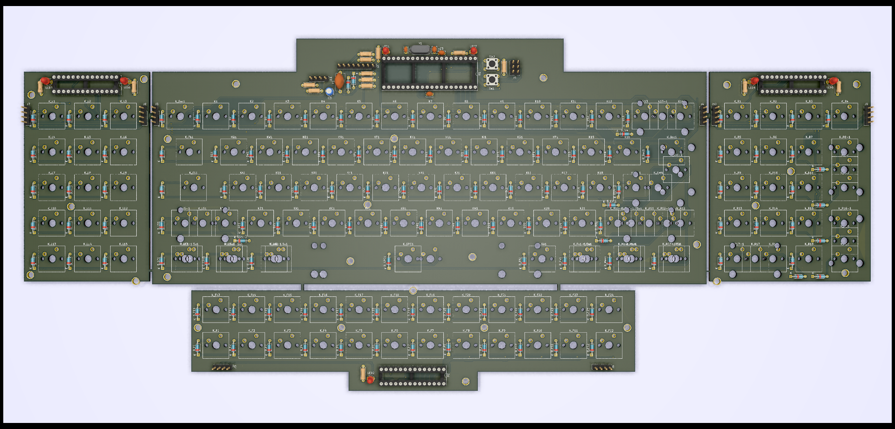

This is my first attempt to make mechanical keyboard. It was supposed to look little bit retro, and have as many additional keys as possible, without taking a lot of space. Additionaly it has customizable and optional sidepanels (Numerical and Navigational).

# License and availability

The whole project is released under GNU GPL v3. What does it mean? You can get fabrication files completely free of charge, modify the source files of keyboard, and even fabricate and sell it without me knowing it. What’s the catch then? You have to have few things in mind:
- There is no liability or warranty from my side that the keyboard is working (especially in current state),
- If you want to fork my project you have to use the same license.

# Firmware

The goal is to use QMK. BUT Board is untested, no one built it yet. So obviously there is no working QMK configuration for it. You might get it working while using Discipline 65 config, but you won’t be able to get all keys working (if any), as pins on ATMega32A microcontroller are wired differently between these two keyboards.

# Supported Layouts

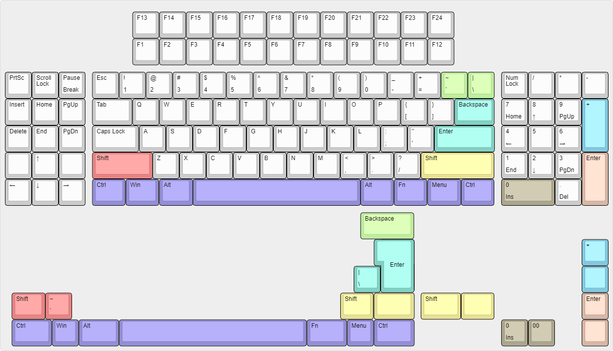

1. Split and 2u `Backspace`,
2. 6.25u and 7u `Spacebar`
3. ISO and ANSI `Return`
4. Split and 2.25u `Left Shift`
5. Split and 2.75 `Full Shift`
6. Split and 2u `Enter (NumPad)`
7. Split and 2u `0 / Ins`
8. Split and 2u `+`

# Parts

|Part|Amount|Picture|
|---|---|---|
|ATMega32A-PU|1|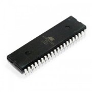|
|DIP-40 15.24mm Socket|1|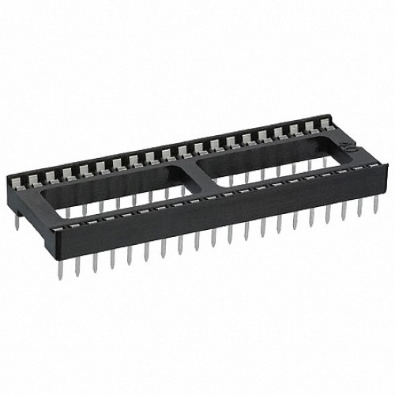|
|MCP23017-E/SP|3||
|DIP-28 7.62mm Socket|3|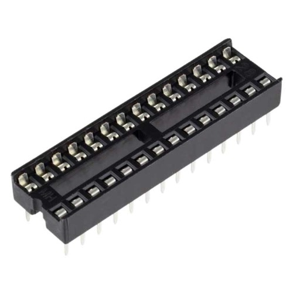|
|MX Style 5-pin Switch|124|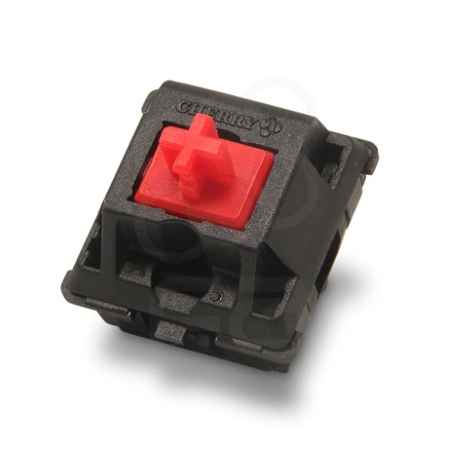|
|Diodes 1N4148|124|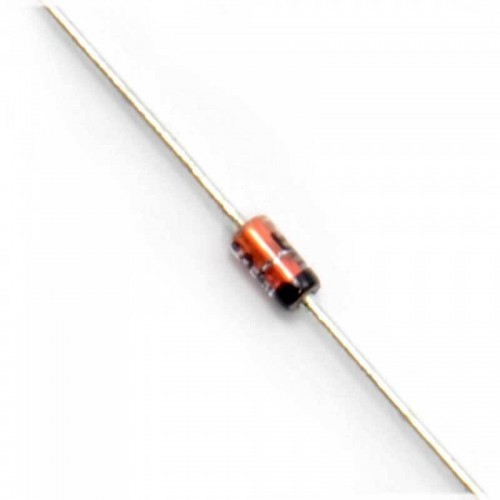|
|ISP Header 02x03 2.54mm|1|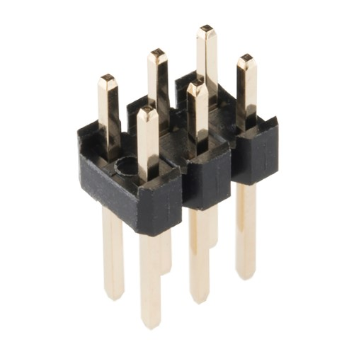|
|16 MHz Crystal|1|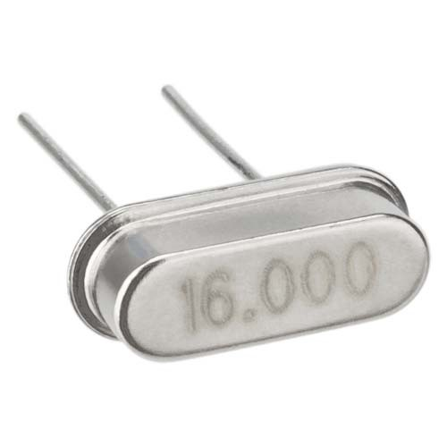|
|6mm Push Buttons|2|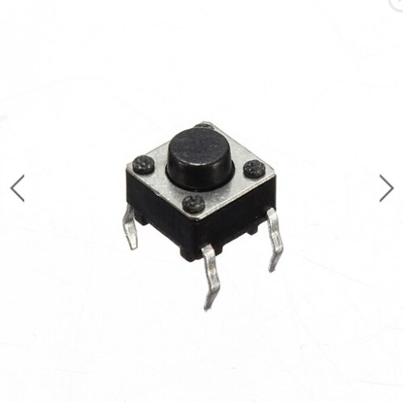|
|LED 3.0mm|7|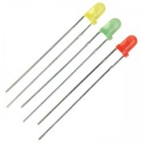|
|Electrolictic Capacitor 4.7uF|1|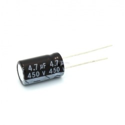|
|Ceramic Capacitor 22pF|2|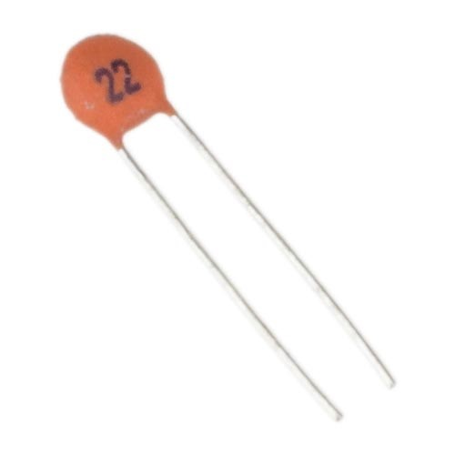|
|Ceramic Capacitor 0.1uF|2|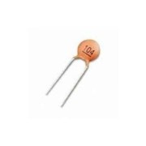|
|Zener Diode 3.6V|2|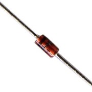|
|Polyfuse 500mA|1|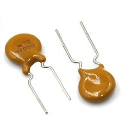|
|Resistor 1.5k Ohm|8|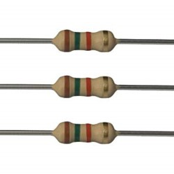|
|Resistor 10k Ohm|3|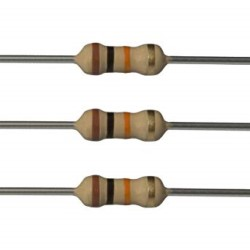|
|Resistor 5.1k Ohm|2|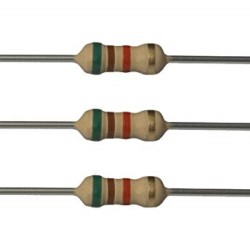|
|Resistor 75 Ohm|2||

# Pre-Release
So as for now, I’ve published pre-release fabrication files for anyone who want to try to build and test it in it’s current form.
