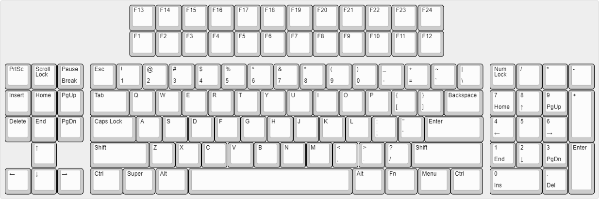
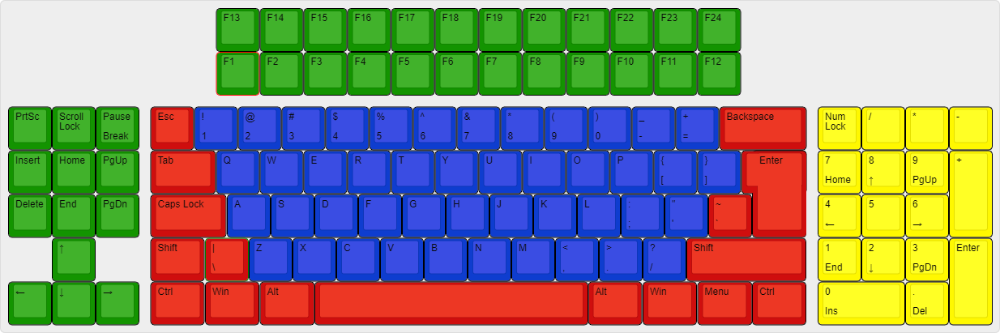

# Svarog-keyboard

This is my first attempt to make mechanical keyboard. It was supposed to look little bit retro, and have as many additional keys as possible, without taking a lot of space.

# Supported Layouts
## Base layout

## ISO layout

## Long Backspace layout

## Double-0 layout
